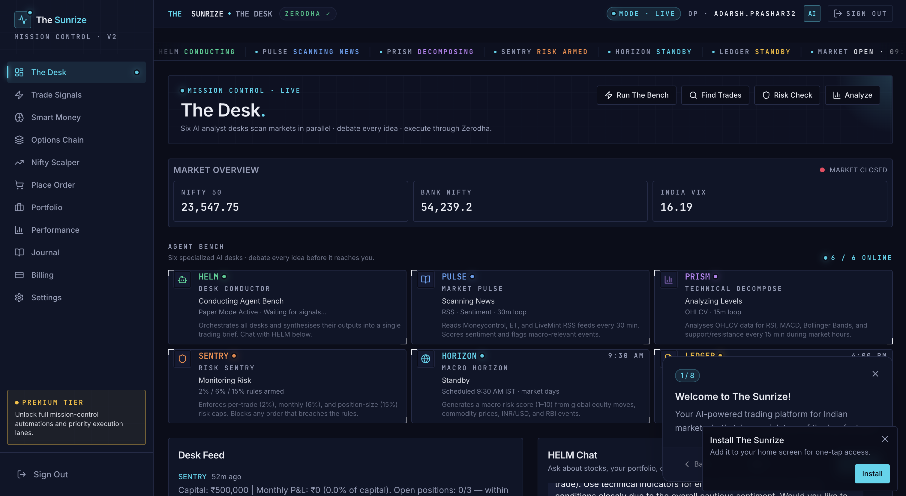

# Adarsh Prashar

### Backend Engineer · Distributed Systems · Currently building [The Sunrize](https://thesunrize.com)

)

---

> Backend engineer at **[Omniful](https://omniful.ai)** by day — joined as the first backend engineer when the team was 10, still here as it crosses 150.  
> Building **[The Sunrize]([https://thesunrize.com](https://thesunrize.com))** by night — an AI co-pilot for Indian retail traders, in private beta with paying users.

---

## 🚢 The Sunrize — what I'm shipping right now

**🔗 Live (invite-only):** [thesunrize.com](https://thesunrize.com)

> Built solo, end-to-end. Frontend, backend, agents, risk engine, broker integration, billing, infra — all me.

| Component | What it does |
|---|---|
| **Six-agent AI architecture** | HELM (orchestrator) · PULSE (news) · PRISM (technicals) · HORIZON (macro) · SENTRY (risk) · LEDGER (auto-journal). Multi-model debate floor — Claude + GPT — with per-user spend caps. |
| **Server-enforced risk engine** | 2% per trade · 6% monthly cap · 15% position size · 3 concurrent positions. Hard-coded, no overrides. |
| **Live broker execution** | Zerodha Kite via official API. Smart bracket orders. Idempotent under network retries. Paper or live with one tap. |
| **Nifty straddle scalper** | Automated ATM straddle. Black-Scholes pricing, India-VIX-derived IV for paper mode. |

*Currently rolling out access by invitation. DM if you want a look.*

---

## 🏢 At Omniful

<table>
<tr>
<td width="50%" valign="top">

**Order Management Service**  
75K+ orders/day · 99.9999% uptime

**Shipment Management Service** — *"the brain"*  
500K+ packages/month routed across carriers

**ClickHouse analytics layer**  
1M+ aggregate queries/month at sub-second p95

</td>
<td width="50%" valign="top">

**Centralized Logging Service**  
Adopted by every backend team · cut incident response 40%

**Monolith → microservices**  
Led end-to-end · zero downtime, zero data loss

**SLO-driven monitoring + auto-deploy**  
Patterns the next 100+ engineers joined into

</td>
</tr>
</table>

> Most of my code lives in private org repos. **[Snapshot of recent activity →](https://github.com/adarsh-omniful?tab=overview&from=2025-12-01&to=2025-12-31)**

---

## 🏆 Competitive Programming

<table>
<tr>
<td width="50%" valign="top" align="center">

</td>
<td width="50%" valign="top" align="center">

</td>
</tr>
</table>

| Platform | Status |
|---|---|
| **Codeforces** | Candidate Master · 2048 *(top 100 in India)* |
| **CodeChef** | 6★ · 2208 |
| **ICPC** | 2x Regionalist |
| **LeetCode** | Guardian · 2249 *(top 0.5%, all-time)* |
| **ICPC** | 2× Regionalist |
| **Google Code Jam** | Round 2 qualifier (2021) |
| **Meta Hacker Cup** | Round 2 qualifier (2021) |

**~3,000 problems solved** across all platforms.

---

## 🧠 Outside work

Independent evaluation work on frontier LLMs — rubric design, response grading, inter-rater reliability, eval pipelines.

---

## 🛠️ Stack

---

**[adarsh.prashar@gmail.com](mailto:adarsh.prashar@gmail.com) · [linkedin.com/in/adarshprashar](https://linkedin.com/in/adarshprashar) · [thesunrize.com](https://thesunrize.com)**

